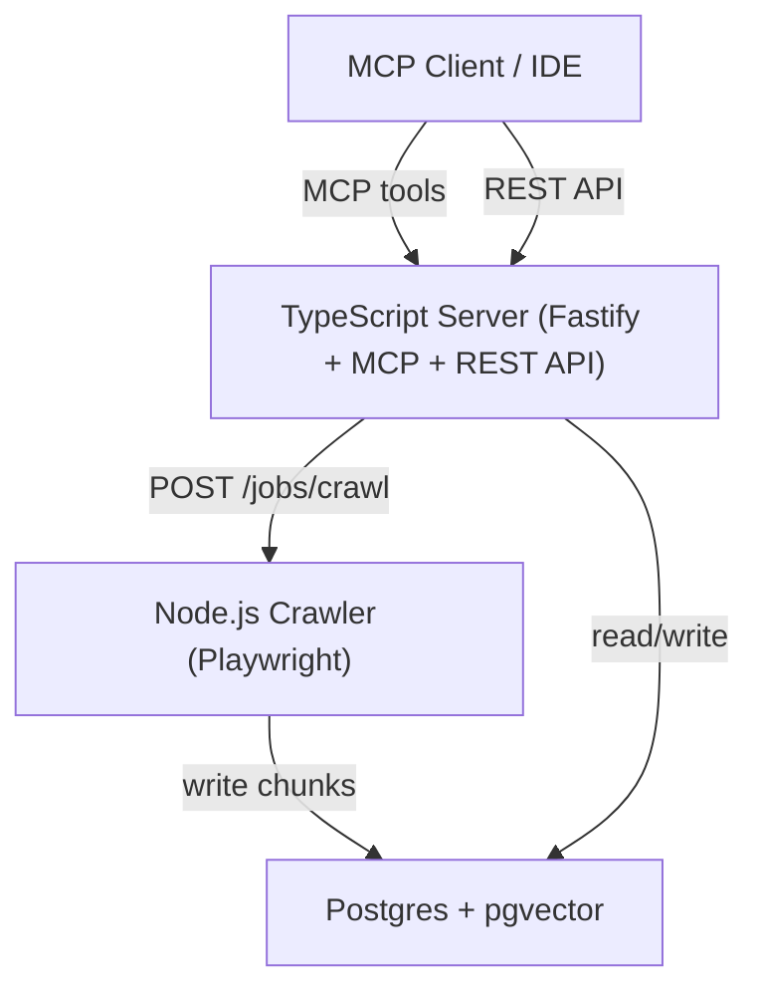

# Noesis

Self-hosted documentation context engine — crawl, embed, and query your docs via MCP.
Index any documentation source into Postgres + pgvector and expose it as MCP tools
for use in GitHub Copilot CLI, VS Code, and any MCP-compatible client.

**Stack:** TypeScript (Fastify) · Node.js Playwright Crawler · Postgres + pgvector

Canonical behavior, contracts, and workflows live in [`specs/`](specs/).

---

## Architecture



```
noesis/
├── src/       TypeScript server — MCP, REST API, import pipeline, embedding
├── crawler/   Node.js/TypeScript — Playwright crawler
└── infra/     Docker Compose
```

---

## Quick Start

### Prerequisites

- Docker Desktop (macOS/Windows) or Docker Engine + Compose (Linux)
- pnpm (for local development without Docker)

### Docker Compose (recommended)

```bash
docker compose -f infra/docker-compose.yml up -d
```

This starts:
- **Postgres + pgvector** on port `5442`
- **RabbitMQ** (optional, profile `all`) on port `5682`
- **Crawler** (Playwright) on port `3001`
- **Server** (Fastify + MCP + embedding) on port `5000`

### Local development

```bash
# Start Postgres only
docker compose -f infra/docker-compose.yml up -d postgres

# Install dependencies and run
pnpm install
pnpm dev
```

---

## Import Pipeline

1. **Register source** — `POST /api/sources` with name, URL, and importer type
2. **Trigger import** — `POST /api/sources/{id}/import`
3. In-process importers (llmstxt, npm-readme, openapi, github) fetch + chunk + store
4. Crawler-based importers (crawler, llmstxt-crawl) delegate to Playwright
5. Embeddings generated automatically (local ONNX, Ollama, or OpenAI)
6. Job marked done, source ready for search

### Importer Types

| Type | Description | Example URL |
|---|---|---|
| `llmstxt` | Fetches `llms-full.txt`, chunks by heading | `https://next.angular.dev/assets/context/llms-full.txt` |
| `llmstxt-meta` | Fetches `llms.txt`, extracts metadata | `https://next.angular.dev/llms.txt` |
| `llmstxt-crawl` | Fetches `llms.txt`, crawls each linked page | `https://next.angular.dev/llms.txt` |
| `crawler` | Playwright docs crawl | `https://angular.dev/guide` |
| `github` | GitHub repository README | `https://github.com/angular/angular` |
| `npm-readme` | npm package README | `https://registry.npmjs.org/lodash` |
| `openapi` | OpenAPI JSON spec | `https://api.example.com/openapi.json` |
| `azuredevops` | Azure DevOps wiki / repo | `https://dev.azure.com/org/project` |

### Example: Index Angular docs

```bash
# Register source
curl -X POST http://localhost:5000/api/sources \
  -H 'Content-Type: application/json' \
  -d '{"name":"Angular","url":"https://next.angular.dev/assets/context/llms-full.txt","importerType":"llmstxt"}'

# Trigger import (returns jobId)
curl -X POST http://localhost:5000/api/sources/<id>/import

# Poll status
curl http://localhost:5000/api/jobs/<jobId>
```

---

## MCP Tools

| Tool | Description | Parameters |
|---|---|---|
| `search_docs` | Semantic + text search with fallback | `query`, `limit?`, `source?` |
| `get_chunk` | Retrieve a specific chunk by UUID | `chunkId` |
| `list_sources` | List all registered sources | — |

All tools are **read-only** and **idempotent**.

### Use with GitHub Copilot CLI

1. Start the server: `docker compose -f infra/docker-compose.yml up -d` or `pnpm dev`
2. Create `~/.copilot/mcp-config.json`:

```json
{
  "mcpServers": {
    "noesis": {
      "type": "http",
      "url": "http://localhost:5000/mcp",
      "tools": ["search_docs", "get_chunk", "list_sources"]
    }
  }
}
```

3. Run `/mcp` in the Copilot CLI to verify the connection.

---

## Further Reading

| Document | Description |
|---|---|
| [`specs/README.md`](specs/README.md) | Canonical spec collection and reading order |
| [`AGENTS.md`](AGENTS.md) | Full architecture, environment variables, pipeline flow |
| [`infra/README.md`](infra/README.md) | Port reference, connection strings, Docker setup |
