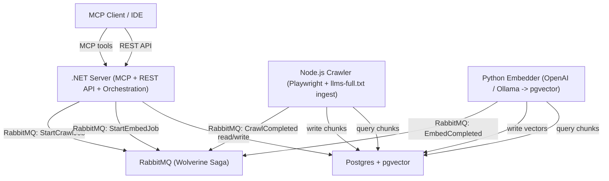

# Noesis

Self-hosted documentation context engine — crawl, embed, and query your docs via MCP.
Index any documentation source into Postgres + pgvector and expose it as MCP tools
for use in GitHub Copilot CLI, VS Code, and any MCP-compatible client.

**Stack:** .NET 10 · Node.js/TypeScript · Python (uv) · Postgres + pgvector · RabbitMQ

---

## Architecture



```
noesis/
├── server/    .NET 10 — MCP server, REST API, import orchestration (Wolverine Saga)
├── crawler/   Node.js/TypeScript — Playwright crawler + llms-full.txt ingest
├── embedder/  Python (uv) — embedding pipeline (OpenAI, Ollama)
└── infra/     Docker Compose (Podman-compatible) + Helm chart
```

---

## Quick Start

### Prerequisites

- Podman (or Docker) + Compose
- .NET 10 SDK
- Node.js 20+
- Python 3.12+ with [uv](https://docs.astral.sh/uv/)

### Option A: Docker Compose (Recommended for first-time setup)

Start all services (Postgres, RabbitMQ, Migrator, Crawler, Embedder) with:

```bash
# Linux with Podman: enable socket once
sudo systemctl enable --now podman.socket

# Start all infrastructure services
docker compose -f infra/docker-compose.yml up -d

# Then run Server locally (see below)
cd server && dotnet run --project src/Gravion.Noesis.Server
```

See [`infra/README.md`](infra/README.md) for port reference and connection strings.

### Option B: Run all services locally (via AppHost)

All services (Server, Crawler, Embedder) plus infrastructure in one command:

```bash
cd server/src/Gravion.Noesis.AppHost
dotnet run
```

Verify services are running:
- Server: http://localhost:5000/health
- Crawler: http://localhost:3001/health
- Embedder: http://localhost:8000/health
- RabbitMQ Management: http://localhost:15682/

### Option C: Start services individually

**Terminal 1 — Infrastructure (Docker Compose):**
```bash
cd infra
docker compose -f docker-compose.yml up -d
```

**Terminal 2 — .NET Server:**
```bash
cd server && dotnet run --project src/Gravion.Noesis.Server
```

**Terminal 3 — Node.js Crawler:**
```bash
cd crawler && npm install && npm run dev
```

**Terminal 4 — Python Embedder:**
```bash
cd embedder && uv sync && uv run uvicorn noesis_embedder.main:app --reload
```

---

## Architecture: Event-Driven Pipeline via RabbitMQ

All inter-service communication uses **RabbitMQ message queues** (Wolverine), not HTTP callbacks:

### Import → Embed → Done

1. **Register & Import** — User calls `POST /api/sources/{id}/import`
2. **Server publishes** — `StartCrawlJob` to `noesis.start-crawl-job` queue
3. **Crawler consumes** — Fetches content, chunks it, stores to Postgres
4. **Crawler publishes** — `CrawlCompleted` to `noesis.crawl-completed` queue
5. **Server consumes** — Saga receives completion, publishes `StartEmbedJob` to `noesis.start-embed-job`
6. **Embedder consumes** — Fetches unembedded chunks, calls OpenAI / Ollama, writes vectors to pgvector
7. **Embedder publishes** — `EmbedCompleted` to `noesis.embed-completed` queue
8. **Server consumes** — Saga marks job done, updates `source.LastImportedAt`

### Search Pipeline

- User calls `search_docs(query)` via MCP tool
- Server: embeds query via `/embed/query` endpoint on Embedder (sync, in-process embedding)
- Server: searches pgvector with cosine distance `<=>` operator
- Server: returns ordered chunks with similarity scores

### RabbitMQ Queues

| Queue | Direction | Message Type | Purpose |
|---|---|---|---|
| `noesis.start-crawl-job` | Server → Crawler | `StartCrawlJob` | Trigger web crawling / text ingest |
| `noesis.crawl-completed` | Crawler → Server | `CrawlCompleted` | Signal crawl finished, chunks stored |
| `noesis.start-embed-job` | Server → Embedder | `StartEmbedJob` | Trigger embedding of unembedded chunks |
| `noesis.embed-completed` | Embedder → Server | `EmbedCompleted` | Signal embedding finished, vectors stored |

All messages use **JSON with camelCase keys** for Wolverine compatibility.

---

## Importers

Register a source with `POST /api/sources` using one of these `importerType` values:

| Type | Description | Example URL |
|---|---|---|
| `llmstxt` | Fetches `llms-full.txt`, chunks by heading | `https://next.angular.dev/assets/context/llms-full.txt` |
| `llmstxt-meta` | Fetches `llms.txt`, extracts metadata | `https://next.angular.dev/llms.txt` |
| `llmstxt-crawl` | Fetches `llms.txt`, crawls each linked page via Playwright | `https://next.angular.dev/llms.txt` |
| `crawler` | Playwright full-page crawl | `https://angular.dev/guide` |
| `github` | GitHub repository README | `https://github.com/angular/angular` |
| `azuredevops` | Azure DevOps wiki / repo | `https://dev.azure.com/org/project` |
| `npm-readme` | npm package README from registry API | `https://registry.npmjs.org/lodash` |
| `openapi` | OpenAPI JSON spec — one chunk per operation | `https://api.example.com/openapi.json` |

### Example: index Angular docs

```bash
# 1. Register source
curl -X POST http://localhost:5000/api/sources \
  -H 'Content-Type: application/json' \
  -d '{"name":"Angular","url":"https://next.angular.dev/assets/context/llms-full.txt","importerType":"llmstxt"}'

# 2. Trigger import (returns jobId)
curl -X POST http://localhost:5000/api/sources/<id>/import

# 3. Poll status
curl http://localhost:5000/api/jobs/<jobId>
# pending → running → embedding → done
```

---

## MCP Tools

| Tool | Description | Parameters |
|---|---|---|
| `search_docs` | Semantic similarity search over all indexed chunks | `query`, `limit?`, `source?` |
| `get_chunk` | Retrieve a specific chunk by UUID | `chunkId` |
| `list_sources` | List all registered sources | — |

All tools are **read-only** and **idempotent**.

### Use with GitHub Copilot CLI

1. Start the server (`dotnet run` or `docker compose up`)
2. Create `~/.copilot/mcp-config.json`:

```json
{
  "mcpServers": {
    "noesis": {
      "type": "http",
      "url": "http://localhost:5000/mcp",
      "tools": ["search_docs", "get_chunk", "list_sources"]
    }
  }
}
```

3. Run `/mcp` in the Copilot CLI to verify the connection.

---

## Further Reading

| Document | Description |
|---|---|
| [`AGENTS.md`](AGENTS.md) | Full architecture, all endpoints, environment variables, pipeline flow |
| [`infra/README.md`](infra/README.md) | Port reference, connection strings, Podman setup |
| [`ROADMAP.md`](ROADMAP.md) | Planned features, migration strategies, import source roadmap |
